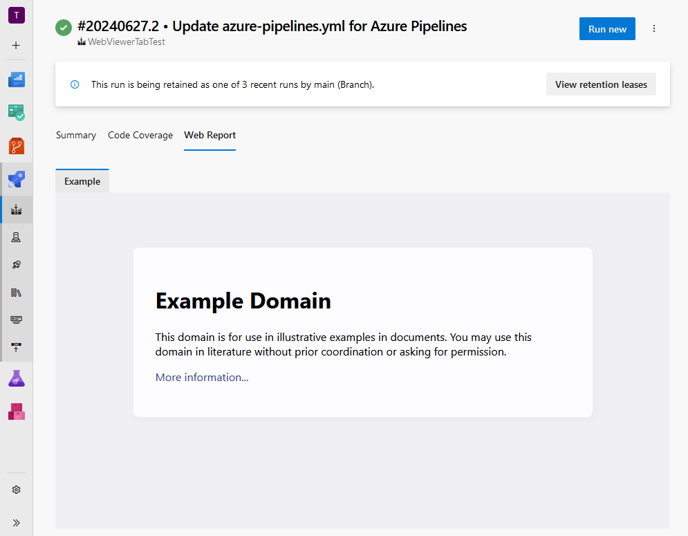
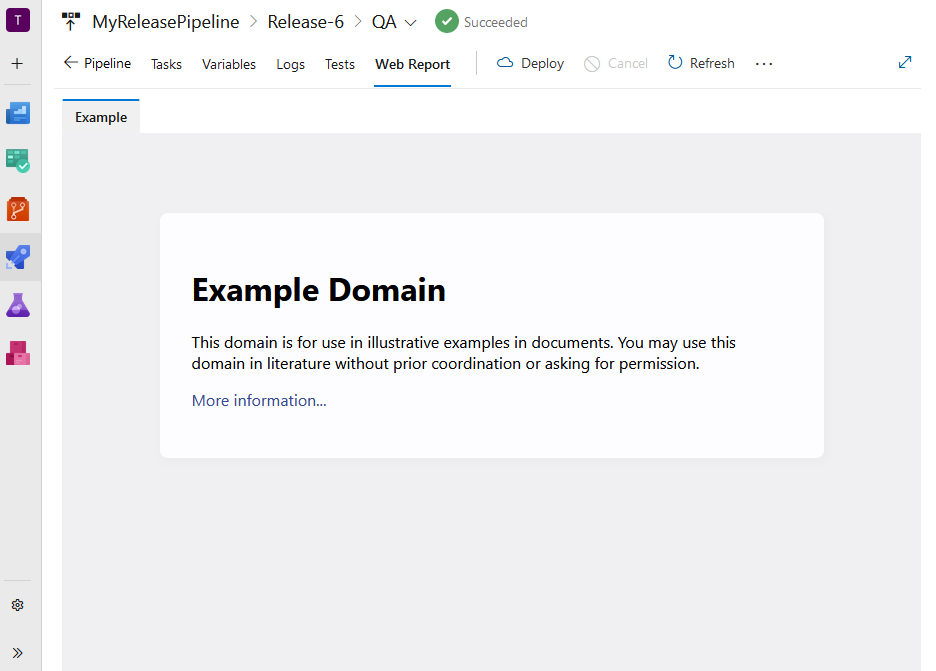

# azure-pipelines-web-report-viewer
An Azure DevOps extension that adds a task for setting a URL, which will be displayed on a separate tab in the Build and Release pages.

### Extension Overview
To display a report on the Web Report tab, you need to use the Setup web report task. This task requires two parameters:

- `url`: the URL of the web resource you want to display.
- `tabName`: the name of the tab where the web resource will be displayed.

### Example YAML Setup
```yaml
steps:
  - task: SetupWebReportTask@1
    inputs:
      tabName: 'Example'
      url: 'https://example.com/'
```

By following this setup, the specified URL will be rendered on the Web Report tab in your Azure DevOps Build and Release pages. Executing the task multiple times allows you to add several sub-tabs, each displaying a different web resource.




